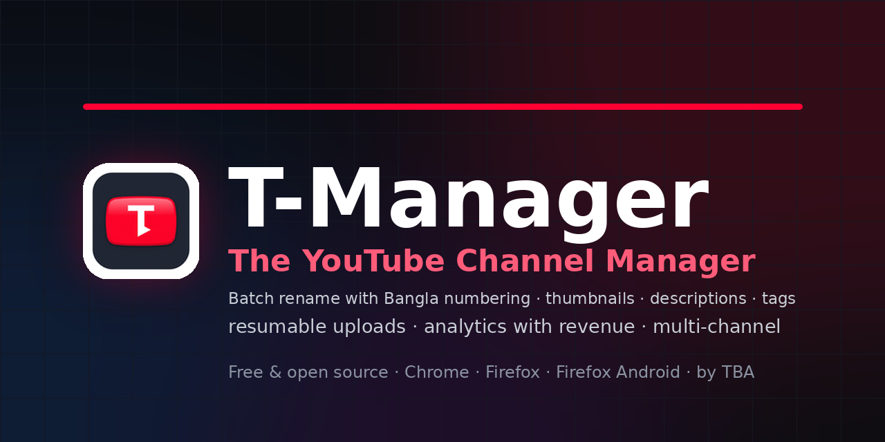

<div align="center">



# T-Manager

**Batch rename with Bangla numbering · thumbnails · descriptions & tags · resumable uploads · analytics with revenue · multi-channel — for Chrome, Firefox & Firefox for Android.**

[](LICENSE)
[](CHANGELOG.md)
[](.github/workflows/ci.yml)
[](CONTRIBUTING.md)
[](https://github.com/tbahsan)
[](../../issues/new?template=bug_report.yml)
[](../../issues/new?template=feature_request.yml)

**[🌐 Landing Page](https://tbahsan.github.io/t-manager/)** ·
**[⬇️ Download](https://github.com/tbahsan/T-Manager/releases/latest)** ·
**[বাংলা README](README-BN.md)** ·
**[🐛 Report a Bug](../../issues/new?template=bug_report.yml)** ·
**[💡 Suggest a Feature](../../issues/new?template=feature_request.yml)**

</div>

---

## 🤔 Why?

Renaming 100 videos, re-tagging a series, or uploading a batch on YouTube means clicking **one video at a time**. T-Manager does it in **one pass** — with a preview, a quota cost estimate, and full undo. Built **readability-first**: every file documented so any developer can jump in.

## ✨ Features

| | Feature | What it does |
|---|---|---|
| ✏️ | **Batch rename + numbering** | 4 modes — *Replace*, *Prepend (keep original)* ⭐, *Append*, *Custom template* · per-kind prefixes: `শর্ট-১`, `লং-২` · Bangla **or** English digits · zero-pad · start/step · custom text before & after the number |
| 🖼️ | **Batch thumbnails** | One image → all selected, or per-video mapping · client-side validation · side-by-side preview · *(Shorts 9:16 builder — coming)* |
| 📝 | **Batch descriptions** | Replace / **Append** ⭐ / Prepend · `{existing}` & `{date}` placeholders |
| 🏷️ | **Batch tags** | Merge (dupe-safe) ⭐ / Replace / Remove · live 500-character guard |
| ⬆️ | **Upload queue** | Multi-file → auto-numbered titles · **resumable 5 MB chunks** survive network cuts · mandatory privacy & made-for-kids pre-flight |
| 📊 | **Analytics dashboard** | Views, watch time, subscribers, impressions/CTR · **revenue + RPM card** for monetized channels · 6h cache |
| 👥 | **Multi-channel** | Connect several channels, switch in one click — cache/history/quota fully separated |
| ⚡ | **Quota tracker** | Shows the API-unit cost of every batch **before** running + daily usage bar |
| ↩️ | **Undo everything** | Every batch snapshots before writing — one-click restore · *(delete is triple-gated instead — Google's API can't undo it)* |
| 🌐 | **English + বাংলা** | English-first UI, one-click Bangla switch |

## 📦 Install (2 minutes — no build tools)

> Full guide with screenshots: **[Landing Page](https://tbahsan.github.io/t-manager/)**

1. **Download** [`t-manager-chrome.zip`](https://github.com/tbahsan/T-Manager/releases/latest/download/t-manager-chrome.zip) or [`t-manager-firefox.zip`](https://github.com/tbahsan/T-Manager/releases/latest/download/t-manager-firefox.zip) → unzip
2. **Chrome:** open `chrome://extensions` → enable *Developer mode* → **Load unpacked** → select the folder
   **Firefox:** open `about:debugging#/runtime/this-firefox` → **Load Temporary Add-on…** → `manifest.json`
3. Popup → **Connect YouTube** → done ✅

## ⚡ The honest quota math

Google gives every API project **10,000 units/day** — T-Manager spends them wisely and tells you the price *before* you run anything:

| Action | Cost | Note |
|---|---|---|
| List videos (×50) | `1u` | cached → previews & undo cost **0** |
| Rename + description + tags | `50u`/video | **merged into ONE call** — not 150 |
| Thumbnail replace | `50u`/video | |
| Analytics query | `≈1u` | separate quota pool + 6h cache |
| Video upload | `1,600u`/video | hard gate + resume-tomorrow queue |

Heavy user? **Pro mode** → paste your own OAuth client ID and enjoy your own daily quota. Guide: [docs/QUOTA.md](docs/QUOTA.md).

## 🐛💡 Feedback & Community

T-Manager grows from **your** real-world workflows — please speak up:

| | | |
|---|---|---|
| 🐛 **Found a bug?** | → **[Open a bug report](../../issues/new?template=bug_report.yml)** | Structured form (area/browser/steps) — the fastest path to a fix |
| 💡 **Feature idea?** | → **[Request a feature](../../issues/new?template=feature_request.yml)** | Tell us your use-case — the best ideas join the roadmap |
| ❓ **Question?** | → **[Discussions](../../discussions)** | "How does X work?" belongs here |

> 💬 Every "you requested, we shipped" starts with an issue. Browse [open issues](../../issues) and drop a 👍 on the ones you want most — reactions drive the priority.

## 🗺️ Roadmap

- [x] M0 — skeleton, build, CI, logo
- [x] Core — auth + multi-channel, batch rename/desc/tags/thumbnails, upload queue, analytics, undo
- [x] UI guide pass — inline instructions, universal number style
- [ ] TH3 — Shorts 9:16 thumbnail builder
- [ ] Store listings — Chrome Web Store + Firefox AMO (incl. Android)
- [ ] v1.0 — polish, verification, launch 🚀

Have an idea? → [open an issue](../../issues/new?template=feature.yml)

## 🧑‍💻 Dev quickstart

```bash
git clone https://github.com/tbahsan/T-Manager && cd T-Manager
npm install
npm run build     # → dist/chrome + dist/firefox (load unpacked)
npm test          # vitest — 17 tests
npm run lint      # eslint
```

**Readability is a feature** — every file has a header block + JSDoc ([convention](CONTRIBUTING.md)). Architecture: [docs/ARCHITECTURE.md](docs/ARCHITECTURE.md) · Releases: [docs/RELEASE.md](docs/RELEASE.md)

## 🤝 Contributing

PRs welcome! Read [CONTRIBUTING.md](CONTRIBUTING.md) — the one rule: *a new developer must understand any file in minutes, from its comments.*

## 👤 Author

<div align="center">

**Tasneem Bin Ahsan (TBA)** — Web Designer & Developer from 🇧🇩 Bangladesh

[](https://github.com/tbahsan)
[](https://x.com/tbahsan)
[](https://www.youtube.com/@TBAhsan)
[](https://tlogz.com/)

</div>

## ⚖️ License

[MIT](LICENSE) · © 2026 Tasneem Bin Ahsan (TBA) · T-Manager is an independent tool — **not affiliated with or endorsed by YouTube or Google**. Logo is YouTube-*inspired*, not a copy.

<div align="center">
<sub>Made with ❤️ in Bangladesh — if T-Manager saves you time, please ⭐ the repo!</sub>
</div>
